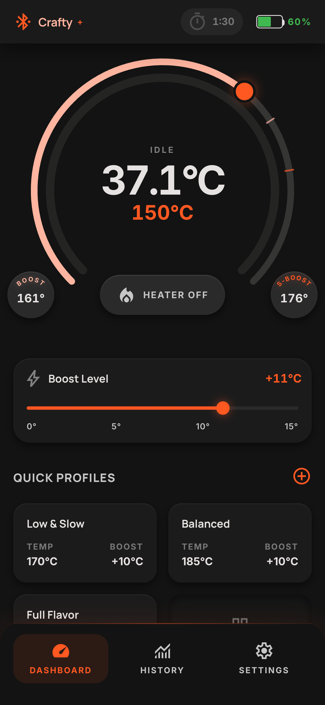
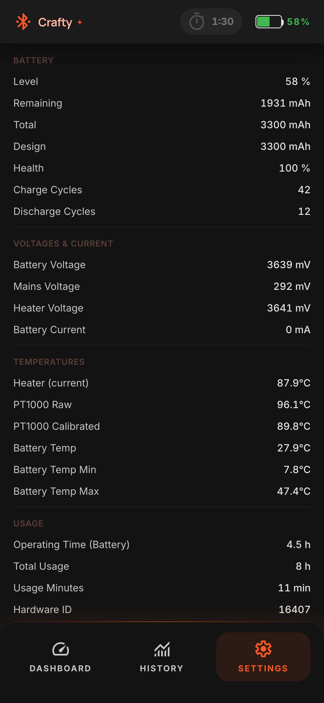
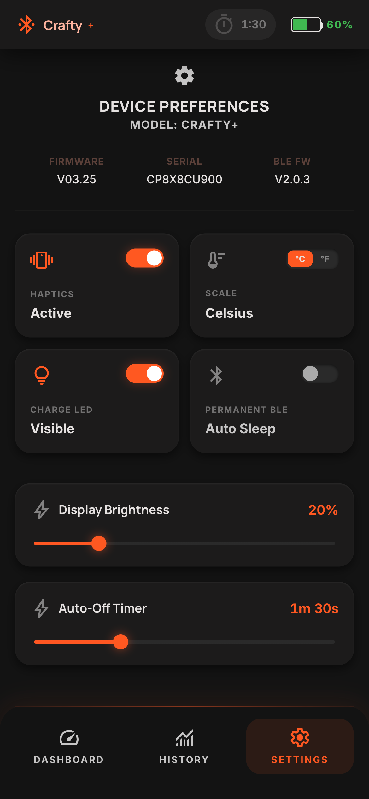
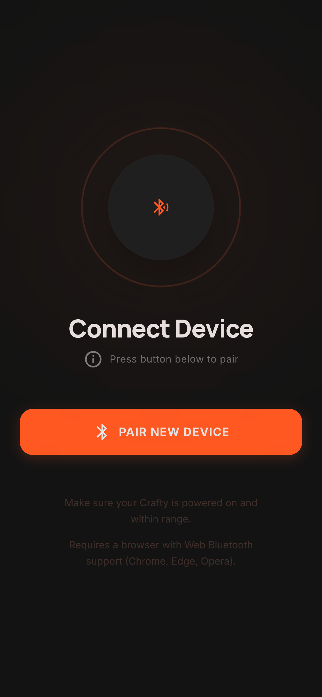

<div align="center">

# vo0t

### Web Bluetooth Controller for Storz & Bickel Vaporizers

[](https://github.com/duramson/vo0t/actions)
[](LICENSE)
[](https://preactjs.com)
[](https://tailwindcss.com)

A fast, lightweight PWA that controls your Crafty+ directly from the browser — no app store, no accounts, no cloud. Pure Web Bluetooth.

Live Page: **[v.o0t.de](https://v.o0t.de)**

</div>

---

## Screenshots

<div align="center">




</div>

---

## Supported Devices

| Device  | Status          |
| ------- | --------------- |
| Crafty+ | Fully supported |
| Crafty  | Supported       |

---

## Features

### Gauge-Based Temperature Control
No more hammering a plus button. The circular gauge lets you drag directly to any target temperature. Boost and Superboost temperatures are **calculated in real time** and displayed as distinct markers on the arc — you always see all three reference points at a glance without navigating anywhere.

### Temperature Profiles
Create, name, and instantly activate presets that set temperature and boost together in one tap. Profiles are shown in a grid on the dashboard, so switching between your "Low & Slow" and "Full Flavor" sessions takes one tap and zero scrolling.

### Diagnostics — Far Beyond the Official App
The official Storz & Bickel app exposes almost nothing. vo0t reads everything the device broadcasts:

- Runtime hours and total session count
- Power-on cycles
- Heater and battery diagnostics
- Serial number, firmware version, hardware revision
- All live characteristics over BLE in real time

### Session Tracking & History
Sessions are automatically recorded in local storage. Each entry logs start time, duration, and the temperatures you ran. Review your usage patterns without any cloud account or telemetry.

### Full Device Control
Everything the BLE protocol exposes, accessible directly:

- Target temperature, Boost, and Superboost adjustment
- Heater on/off toggle
- LED brightness
- Auto-Off timer
- Vibration on/off
- Charge indicator LED on/off
- Permanent Bluetooth visibility toggle
- Factory restart trigger

### Privacy First
Fully client-side. Nothing leaves your browser. No accounts, no analytics beyond an anonymous page-view counter, no syncing. All profiles and session history live in your device's local storage.

---

## Browser Requirements

Web Bluetooth is required and not supported by all browsers.

| Platform                | Supported Browsers                                                   |
| ----------------------- | -------------------------------------------------------------------- |
| Android                 | Chrome, Edge, any Chromium-based                                     |
| Windows / macOS / Linux | Chrome, Edge, any Chromium-based                                     |
| iOS / iPadOS            | WebBLE or Bluefy (App Store) — Safari does not support Web Bluetooth |

---

## Tech Stack

| Tool     |                                        |
| -------- | -------------------------------------- |
| UI       | [Preact](https://preactjs.com) + Hooks |
| Language | TypeScript (strict)                    |
| Bundler  | Vite 8                                 |
| Styling  | Tailwind CSS v4                        |
| Protocol | Web Bluetooth API                      |

---

## Local Development

```sh
git clone https://github.com/duramson/vo0t.git
cd vo0t/app
npm install
npm run dev
```

Open the `localhost` URL in a Chromium-based browser. For a production build:

```sh
npm run build
# Output: app/dist/
```

---

## Acknowledgments

Protocol research and initial inspiration drawn from:

- [crafty-control](https://github.com/J-Cat/crafty-control) by J-Cat
- [reactive-volcano-app](https://github.com/firsttris/reactive-volcano-app) by firsttris

---

## Disclaimer

This project is independent and not affiliated with, endorsed by, or sponsored by Storz & Bickel GmbH & Co. KG. Use at your own risk.
